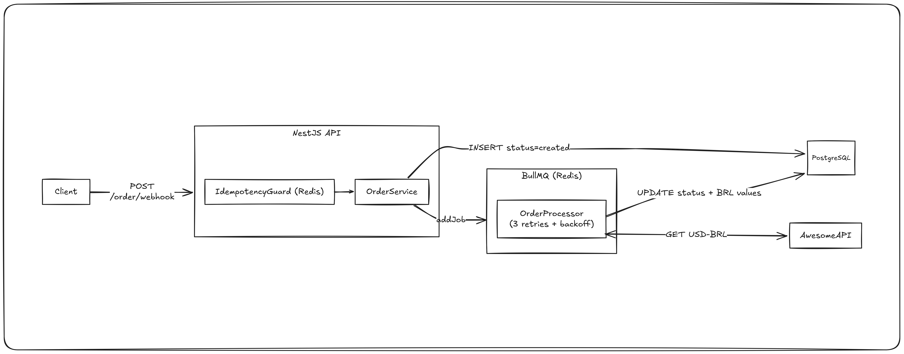
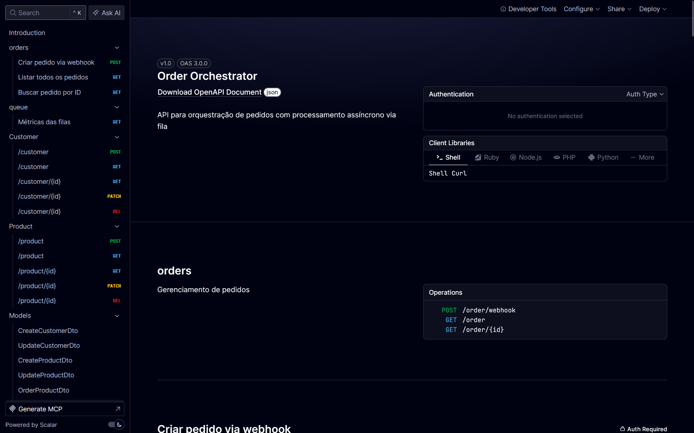

<div align="center">


<p>Order Orchestrator 📦 &nbsp;·&nbsp; Em desenvolvimento</p>

</div>

# Order Orchestrator

API REST para **orquestração de pedidos** com processamento assíncrono via fila. Ao receber um pedido, a aplicação persiste os dados, enfileira um job e — de forma assíncrona — busca a cotação do dólar em tempo real, converte os valores para BRL e atualiza o status da venda.



---

## Como executar o projeto

### Pré-requisitos

- [Node.js 20+](https://nodejs.org/)
- [pnpm](https://pnpm.io/)
- [Docker](https://www.docker.com/)

### Passo a passo

```bash
# 1. Clone o repositório
git clone https://github.com/inbazz/order-orchestrator.git
cd order-orchestrator

# 2. Instale as dependências
pnpm install

# 3. Configure as variáveis de ambiente
cp .env.example .env

# 4. Navegue até a pasta docker
cd docker

# 5. Suba os containers (PostgreSQL + Redis + BullMQ Redis + Aplicação NestJS)
docker compose up -d

# 6. Volte para a raiz do projeto
cd ..

# 7. Execute as migrations do banco de dados
pnpm drizzle:migrate

# 8. Inicie o servidor em modo de desenvolvimento
pnpm start:dev
```

A API estará disponível em `http://localhost:3000`.

---

## Documentação da API

Com o servidor rodando, acesse:

```
http://localhost:3000/docs
```

Você verá a interface interativa do **Scalar** com todos os endpoints documentados, schemas de request/response e suporte a testes direto pelo browser.



>[!important]
> O spec OpenAPI bruto (JSON) também fica disponível em `http://localhost:3000/docs/openapi.json` para uso em ferramentas externas.

---

## Testes

Para executar a suíte de testes de integração:

```bash
pnpm test
```

Para este desafio, foquei na cobertura da lógica de negócio e na orquestração assíncrona. Devido ao prazo, optei por mocar as dependências externas (Redis/Postgres) nos testes de integração. Em um cenário real de produção, a abordagem ideal seria utilizar **Testcontainers** para subir instâncias reais do banco e da fila, garantindo que as queries do Drizzle e o comportamento do BullMQ fossem validados de ponta a ponta.

---

## Tecnologias

| Tecnologia | Papel |
|---|---|
| [NestJS](https://nestjs.com/) | Framework principal |
| [TypeScript](https://www.typescriptlang.org/) | Linguagem |
| [Drizzle ORM](https://orm.drizzle.team/) | ORM e migrations |
| [PostgreSQL](https://www.postgresql.org/) | Banco de dados relacional |
| [BullMQ](https://bullmq.io/) | Fila de jobs com retry |
| [Redis](https://redis.io/) | Idempotência e fila BullMQ |
| [Scalar](https://scalar.com/) | UI interativa da documentação |
| [AwesomeAPI](https://docs.awesomeapi.com.br/) | Cotação USD-BRL em tempo real |

---

## Autor

Desenvolvido por **Vinícius Reis** · [inbazz](https://github.com/inbazz)
